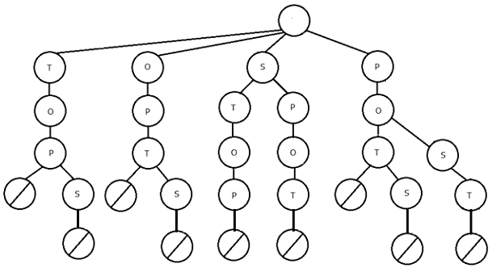

# Trie data structure

Program that allows the user to generate a trie data structure and sort some words into the trie. A trie is a data structure that permits efficient lookup of words in a dictionary.

## ⚙️ Technologies

## ⚡ Features

-   Implements a Trie of uppercase alphabetical letters.
-   Simple menu to navigate the progem.
-   User can provide letters and the program searches for words combined with those letters from a dictionary and add them to the trie.

## 💻 Supported operations

-   `contains(String s) [return type boolean]`, true if the word ‘s’ is contained in the trie.
-   `isPrefix(String p) [return type boolean]`, true if ‘p’ is a prefix of any word in the trie.
-   `insert(String s) [return type void]`, inserts the word ‘s’ in the trie.
-   `delete(String s) [return type void]`, deletes ‘s’ from the trie.
-   `isEmpty() [return type boolean]`
-   `clear() [return type void]`
-   `constructors, accessors, mutators`, as needed
-   `allWordsPrefix(String p) [return type String[]]`, this method returns all words whose prefix is ‘p’.
-   `size() [return type int]`, returns the number of nodes in the trie.

## 🔧 Installation

1. Install newest version of [Java](https://www.java.com/)
2. Run program

## ✒️ Author

| [ @M-Alhassan](https://github.com/M-Alhassan) |
| :---------------------------------------------------------------------------------------------------------------------------: |
